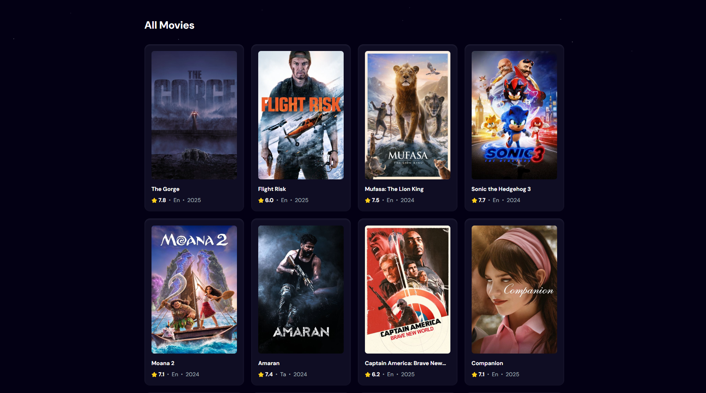

# Sma movie - Your Movie Discovery App

Sma Movies is a web application that allows you to discover and explore movies using The Movie Database (TMDb) API. You can search for movies by title and browse popular movies. The app is designed with a user-friendly interface, making it easy to find your next favorite film.

## Features

- **Movie Search:** Search for movies by title using the TMDb API.
- **Popular Movies:** Browse a list of currently popular movies, updated regularly.
- **Loading Indicator:** Displays a loading spinner while fetching movie data, ensuring a smooth user experience.
- **Error Handling:** Shows informative error messages if something goes wrong during the API request.
- **Debounced Search:** Optimizes search functionality to reduce API calls, making searches faster and more efficient.
- **Responsive Design:** The app is designed to be used on various screen sizes.

## Technologies Used

- **React:** A JavaScript library for building user interfaces.
- **TMDb API:** The Movie Database API for movie data.
- **React-Use:** A collection of useful React hooks, including `useDebounce`.
- **Vite:** For development and build environment.
- **Tailwind CSS:** For fast and easy styling.

## Getting Started

1.  **Clone the repository:**

    ```bash
    git clone https://github.com/abrahammatos/sma-movies.git
    ```

2.  **Navigate to the project directory:**

    ```bash
    cd smamovie
    ```

3.  **Install dependencies:**

    ```bash
    npm install
    # or
    yarn install
    ```

4.  **Create environment variables:**

    - Create a `.env` file in the project's root directory.
    - Inside the `.env` file, add the following line, replacing `<your-tmdb-api-key>` with your actual TMDb API key:

    ```
    VITE_TMDB_API_KEY=<your-tmdb-api-key>
    ```

    - You can get a api key by creating an account on this website: [https://www.themoviedb.org/](https://www.themoviedb.org/)

5.  **Start the development server:**

    ```bash
    npm run dev
    # or
    yarn dev
    ```

6.  Open [http://localhost:5173](http://localhost:5173) in your browser to view the app.

## API Key

This project uses The Movie Database (TMDb) API. To make the app work, you'll need to:

1.  **Create an account:** Sign up for a free account at [https://www.themoviedb.org/](https://www.themoviedb.org/).
2.  **Get your API key:** Once you're logged in, go to your account settings and request an API key.
3.  **Add it to your `.env` file:** Follow step 4 under "Getting Started" to add your API key to your local project.

## Screenshots

Here are some screenshots showcasing the main features of the smamovie app:




## Contributing

Contributions are welcome! If you'd like to help improve smamovie, please follow these steps:

1.  Fork the repository.
2.  Create a new branch for your feature or bug fix.
3.  Commit your changes with clear and concise messages.
4.  Submit a pull request.
